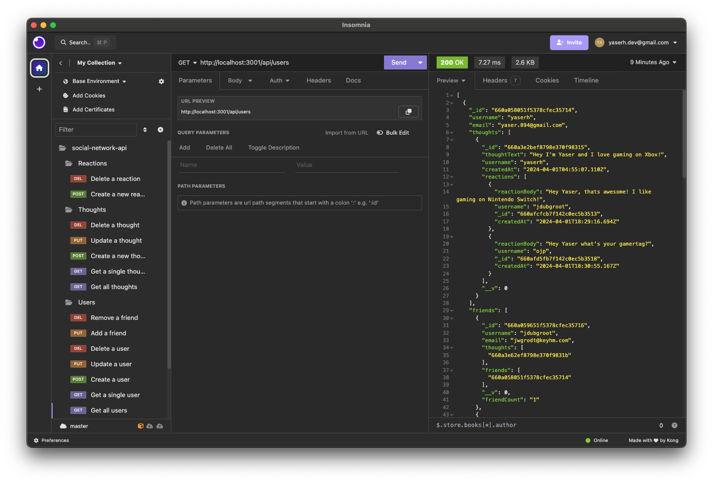

# social-network-api
Week 18 Challenge

In this challenge I was given the task of creating an application which functions as a social network. It utilized NoSQL and MongoDB for database management and contains the following features:

- GET, POST, PUT, and DELETE users and thoughts


## Installation
To install this application, download the repository files and open the root folder in your command line. You will also need Node.js installed. Install all other dependencies using the following command:
```
npm i
```
Then to run the application, use the command: 
```
node index.js
```

## User Story
```
AS A social media startup
I WANT an API for my social network that uses a NoSQL database
SO THAT my website can handle large amounts of unstructured data
```

## Acceptance Criteria
```
GIVEN a social network API
WHEN I enter the command to invoke the application
THEN my server is started and the Mongoose models are synced to the MongoDB database
WHEN I open API GET routes in Insomnia for users and thoughts
THEN the data for each of these routes is displayed in a formatted JSON
WHEN I test API POST, PUT, and DELETE routes in Insomnia
THEN I am able to successfully create, update, and delete users and thoughts in my database
WHEN I test API POST and DELETE routes in Insomnia
THEN I am able to successfully create and delete reactions to thoughts and add and remove friends to a user’s friend list
```


 

Application available for download at: https://github.com/yaserhdev/social-network-api

Demo video of application available at: https://youtu.be/m4tZyA3nE8o